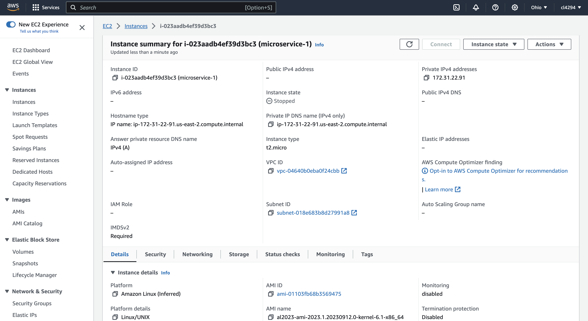

# Status report

## Clone and Modify the Starter Project

- Place a screen capture of your directory below. Display the structure in a terminal window, PyCharm, file explorer
or any other mechanism.

|  |
|:-----------------------------------:|
|         __Cloned Project__          | 

## Execute the Starter Project

You can choose any formats for the screen capture as long as it shows your project executing. My simple example shows
and execution window and browser side-by-side.

|  |
|:-----------------------------------:|
|        __Project Execution__        | 

## Create Your Own GitHub Project

Make a copy of the project and create a project in GitHub. Show the project.

|  |
|:------------------------:|
|  __Project on GitHub__   | 

## Deploy and Test Project on AWS

Show the information about your VM through the console.
(I took this screenshot after I stopped the instance)

|  |
|:-----------------------------:|
|        __AWS Console__        | 

Show the application running in the EC2 terminal and browser.

|  |
|:-----------------------------:|
|      __Service Running__      | 